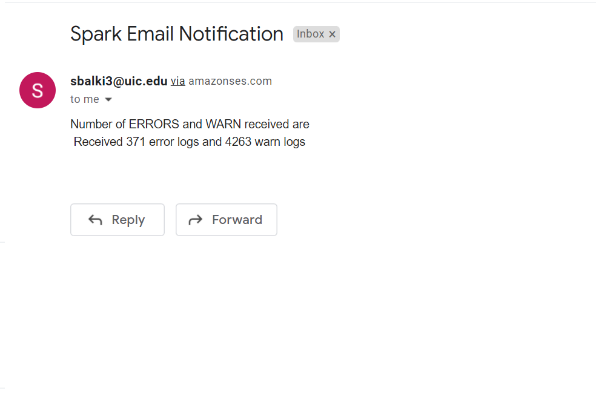

# Kafka -> Spark Aggregation -> AWS Email Notification

Part 2 of the  Project. Spark program connects to the Kafka stream, reads the messages and performs aggregation. Aggregated messages are sent as an email to the stakeholders if the ERROR/WARN messages matches a specific pattern.

## Specifications
- Scala 2.12.12
- Akka Kafka Streaming - 1.0.1
- Spark - 2.4.4
- SLF4S - 2.0.0
- Typesafe Config - 1.4.1
- Logback - 1.3.0
- AWS SDK - 1.12.89
## Project Structure
```
src
├── main
│   ├── resources
│   │   ├── application.conf
│   │   └── logback.xml
│   └── scala
│       ├── HelperUtils
│       │   ├── Constants.scala
│       │   ├── CreateLogger.scala
│       │   ├── EmailService.scala
│       │   ├── ObtainConfigReference.scala
│       │   └── SparkUtil.scala
│       └── SparkAggregation.scala
└── test
    └── scala
        └── DataStreaming
            ├── ConfigTestSuite.scala
            ├── EmailTestSuite.scala
            └── SparkTestSuite.scala
```

## How to Run

**Step 1:** 

Clone the repository and navigate inside the working directory
```
git clone https://github.com/gnzeleven/Cloud-Computing---Streaming-Data-Pipeline.git
cd Cloud-Computing---Streaming-Data-Pipeline
cd Kafka-Spark-AWSEmail
```

**Step 2:**

Update the following configurations in the `application.config`

- `kafkaBroker`: Change this with the Live AWS Kafka Cluster URL.
- `kafkaTopic`: Update this configuration with the Kafka Topic name.

**Step 3:**

Create AWS Credentials for email service. Save the aws_access_key_id and aws_secret_access_key in a config file. 

Please refer this [AWS Reference Documentation](https://docs.aws.amazon.com/sdkref/latest/guide/file-location.html).

**Step 4:** 
Run the Project using sbt

```
sbt clean compile run
```

Run the following command to test the project

```
sbt test
```

## Functionality
### Spark Aggregation

**Connect to Kafka Stream**

- Get the Kafka cluster endpoint from the configurations.
- Create a Direct Stream and Subscribe to the messages from Kafka.

**Aggregate Data**

- Read the stream of data, and extract the log messages.
- For each log messages, extract the logLevel(eg: ERROR, WARN, INFO and DEBUG), and keep count of each logging levels.
- Trigger an Email to the stakeholders if the ERROR/WARN count crosses a specific threshold.

**Email Service**

- Uses AWS Email Service to alert stakeholders about the application status based on log files.
- Load sender and receiver information from `application.config` file. Make sure to verify sender and receiver email id's in AWS.
- Constructs an email with the passed arguments, and sends it to the receivers.
- Message content of the email can be modified from the config file.

**Aggregated result sent as email Screenshot** 


